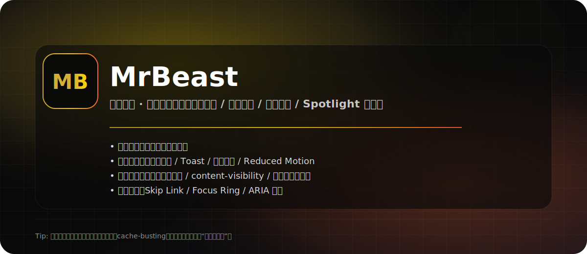

# MrBeast - 野兽先生传奇（致敬风格单页）

<div align="center">
  

  <p>
    一个纯静态、一页式的“玻璃拟态 + 粒子宇宙 + 轮播见证 + Spotlight 光晕”风格页面。
  </p>

  <p>
    
    
    
    
  </p>
</div>

---

## 目录

- [亮点](#亮点)
- [快速开始](#快速开始)
- [质量检查](#质量检查)
- [目录结构](#目录结构)
- [原子级审查要点](#原子级审查要点)
- [动效模式](#动效模式)
- [无-JS-退化策略](#无-js-退化策略)
- [定制与二次开发](#定制与二次开发)
- [免责声明](#免责声明)

---

## 亮点

| 维度 | 做了什么 | 为什么这样做 |
| --- | --- | --- |
| 视觉 | 深色极光基底、玻璃拟态卡片、细边框与高光 | 保持“高级质感”，避免死黑/死白的廉价观感 |
| 交互 | 移动端导航（JS 菜单 + 无 JS 退化）、回到顶部、Toast 友好反馈 | 不出现“点了没反应”的生硬体验 |
| 动效 | 粒子背景、Spotlight 光晕跟随、轮播拖拽/自动播放、动效模式（自动/关/开） | 沉浸感与可控性并重：既有惊艳动效，也能一键降级/覆盖系统偏好 |
| 性能 | 粒子连线由 O(n²) 改为网格近邻搜索；`content-visibility` 跳过视口外渲染；Save-Data/2G 自动降载；重型动效 idle 初始化 | 大屏/弱设备/弱网也能更稳，减少电量消耗与启动压力 |
| 可访问性 | Skip Link、Focus Ring、ARIA 标签、移动端菜单 inert/aria-hidden + 焦点陷阱、轮播 `aria-live` 播报、forced-colors 高对比度兜底、无 JS 退化（导航/轮播） | 键盘/读屏/高对比度/无 JS 场景都更友好，语义更清晰 |
| 工程 | 核心 CSS/JS 外链 + 版本号 cache-busting；无依赖 `scripts/validate.js` + CI；Web Manifest + robots.txt | 修复缓存幽灵，并将“质量标准”固化为可执行规则 |

---

## 快速开始

### 方式 A：直接打开（零依赖）

1. 克隆仓库
2. 直接打开 `index.html`

> 说明：本项目不依赖后端接口，不需要构建流程；双击打开即可浏览。

### 方式 B：本地静态服务（更推荐）

某些浏览器在 `file://` 场景可能对缓存/导航行为表现不一致，建议用本地静态服务打开：

```bash
python -m http.server 8080
```

然后访问：

```text
http://localhost:8080
```

> 端口提示：如果 `8080` 已被占用，请换一个端口（例如 `8081`）。

---

## 质量检查

仅使用 Node.js 自带语法检查（无依赖）：

```bash
node --check assets/app.js
```

项目自检（无依赖，推荐在提交前跑一次）：

```bash
node scripts/validate.js
```

如果你启用了 GitHub Actions，本仓库内置了最小 CI：

- 工作流：`.github/workflows/ci.yml`
- 内容：JS 语法检查 + 项目校验（HTML 结构、缓存穿透版本一致性、A11y/安全基础规则等）

---

## 目录结构

```text
.
├─ index.html
└─ assets/
   ├─ app.js
   ├─ styles.css
   ├─ favicon.svg
   └─ readme-cover.svg
```

更多文档：

- `docs/QUALITY.md`：原子级审查标准（交互 / A11y / 性能 / 缓存穿透）
- `docs/DEPLOY.md`：GitHub Pages 部署指南
- `docs/ARCHITECTURE.md`：架构与模块说明（Quark-Level）

---

## 原子级审查要点

以下是本项目在交付层面坚持的“原子级”自检原则（方便你二次改造时保持一致）：

1. **默认可见**：首屏核心内容不依赖 JS 才可见（避免 `opacity: 0` 等“等待 JS 救场”的风险）。
2. **Reduced Motion**：侦测 `prefers-reduced-motion`，自动降级/关闭高强度动效。
3. **移动端导航无幽灵焦点**：菜单关闭时对导航列表启用 `inert` + `aria-hidden`（仅移动端），避免读屏/键盘“焦点穿模”。
4. **缓存穿透**：每次修改核心逻辑或关键样式后，更新 `index.html` 里资源版本号 `?v=...`，确保强制刷新生效。
5. **不在页面主区域裸露错误**：交互反馈使用 Toast/提示文案，避免把原始日志或错误堆栈直接渲染到 UI。
6. **无 JS 退化**：移动端导航链接仍可访问；轮播退化为列表并隐藏无效控制按钮。
7. **手动动效模式**：提供“自动/关/开”三档开关，允许覆盖系统 `prefers-reduced-motion` 偏好。

---

## 动效模式

页面右下角提供 `动效：自动/关/开` 三档开关：

- **自动**：跟随系统设置（`prefers-reduced-motion`）
- **关**：强制减少动效（隐藏粒子/光晕/光标跟随，轮播停止自动播放，滚动入场不做位移）
- **开**：强制启用动效（即使系统设置为“减少动态效果”）

该偏好会持久化到 `localStorage`，刷新后仍会生效。

快捷键：`Alt + M`（在未聚焦输入框时可用）。

---

## 无 JS 退化策略

本项目默认追求“JS 增强”而非“JS 依赖”，因此提供了可用的 No-JS 退化：

- **移动端导航**：无 JS 时不显示汉堡按钮，导航链接直接可见/可键盘操作
- **粉丝见证轮播**：无 JS 时退化为列表，隐藏无效控制按钮

> 注：无 JS 场景下，表单不会触发 Toast/草稿保存等交互增强（页面底部有 NoScript 提示）。

---

## 定制与二次开发

### 修改配色/动效强度

- 主样式：`assets/styles.css`
- 交互逻辑：`assets/app.js`

### 修改后“强制刷新”生效

打开 `index.html`，更新资源版本号（例：`v=20251218-01`）：

```html
<link rel="stylesheet" href="assets/styles.css?v=20251218-01">
<script src="assets/app.js?v=20251218-01" defer></script>
```

---

## 免责声明

- 本项目为致敬风格的静态页面作品，**非官方**，与 MrBeast 团队无任何隶属或合作关系。
- 文案/数据为展示用途，非实时准确数据源。
